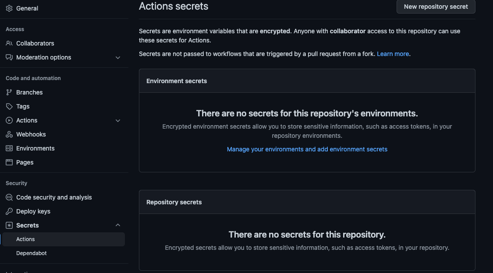
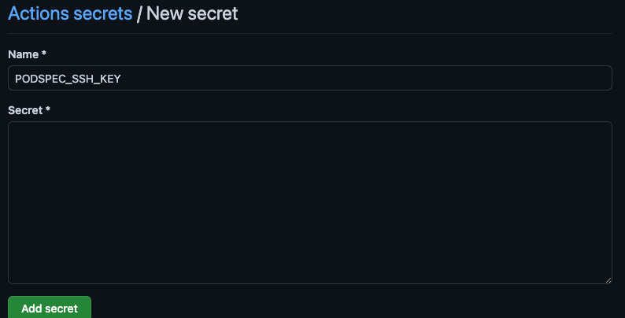

# Publishing Podspecs to GitHub

Cocoapods supports hosting private podspec repos. These are git repos that only host release publishing info for
Cocoapods podspecs, not their actual code. If you are planning to publish KMM Xcode Frameworks with Cocoapods, that
means you'll need a separate git repo dedicated to publishing podspec versoins. See the
[Cocoapods Documentation](https://guides.cocoapods.org/making/private-cocoapods.html) for more context.

## Note

We *highly* recommend publishing from CI rather than from your local machine, although if properly configured you
can do either. Our documentation generally assumes a CI configuration.

## Overview

When using the KMM Bridge Cocoapods configuration to publish to a private podspec repo,
you'll need to do some extra setup in your CI action to give the runner access to the podspec repo. This doc will
give examples for GitHub actions but the same general steps should apply to other CI setups.

## Creating a Podspec Repo

First you'll need a GitHub repo to store your remote podspecs. Simply create a new repo in GitHub and be sure to
initialize it with a README file. This sets up your main branch and creates an initial commit. The publish task will NOT 
work on an empty repository that contains no commits. 

## Adding the Spec Repo to Your Project

Once you've created a spec repo, you'll need to pass the url to KMMBridge in the configuration block. Make sure to use the
ssh url and not the http url or the CI setup described here won't work. 

```kotlin
kmmbridge {
  ...
  cocoapods("git@github.com:<ORG>/<PODSPEC REPO>.git")
  // NOT THIS
  // cocoapods("https://github.com/ORG/REPO.git")
}
```
## Deploy Keys 
### Create Deploy Keys
You'll need a deploy key to give your CI access to the spec repo. To set up a deploy key, create an ssh public/private
key pair on your local machine using the following command

`ssh-keygen -t ed25519 -f deploykey -C "git@github.com:<ORG>/<PODSPEC REPO>"`

- `-f deploykey` gives a custom name `deploykey` to the generated keys and will put both keys in the current directory. If
  you run this command in your repo make sure you delete these files after finishing setup and do NOT commit them to your repo.

- `-C "git@github.com:<ORG>/<PODSPEC REPO>"` adds the spec repo as a comment to the key that gives the ssh client a hint on when to
  use this key. This is optional but recommended.

After running this command, your working directory will have two files: `deploykey`, the private key, and `deploykey.pub`, the public key.
The public key, `deploykey.pub`, is what you will set up as a deploy key in your Podspec repo. The private key, `deploykey`, will need to be added in the
ssh agent in your CI actions in order to pull/push from the spec repo. 

### Add Deploy Key to Podspec Repo
To add `deploykey.pub` to your Podspec repo, go to Settings->Deploy Keys (you'll need admin access to the repo), then click *Add Deploy Key* 


Give your deploy key a useful title like `Podspec Publish Key`, then copy the contents of `deploykey.pub` into the *Key* field.
Click *Add key* and your deploy key will be setup. 


### Add Deploy Key to KMM Repo
Once you have the public key of your deploy key pair, you'll need to have the private key available in order to publish from
CI. 

In the repo for the KMM code you want to publish, go to Settings -> Secrets -> Actions (you'll need repo admin).



Click *Add Secret* and name your secret `PODSPEC_SSH_KEY`. You must match this secret name exactly for the KMMBridge GitHub
workflow to work properly.

Paste the entire contents of `deploykey` into the *Secrets* field then click *Add Secret* 



Once these keys are added, you can use the KMMBridge workflow to handle adding the key to the ssh agent and calling 
the publish task to push a remote podspec to your podspec repo. For a more manual workflow setup, see [this section](https://github.com/touchlab/KMMBridgeGithubWorkflow/blob/f6075b60151caf15b8759c811b0d2458fbdd08a7/.github/workflows/faktorybuild.yml#L21) 
in our workflow to see how the deploy key is used. 