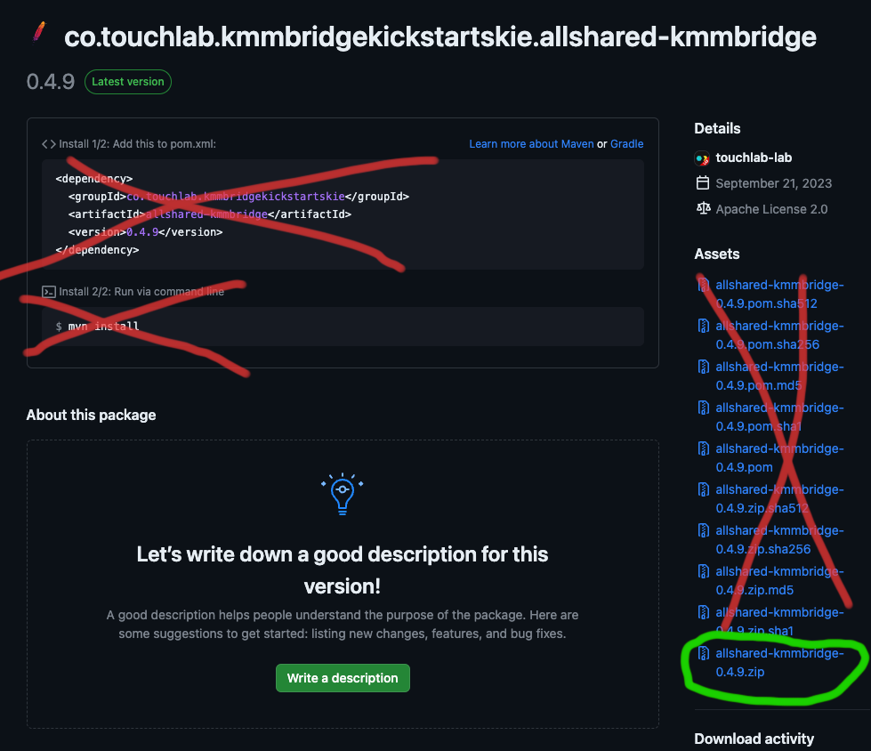

KMMBridge and it's reference workflow are doing several things that may seem confusing, but they're necessary to publish Kotlin Xcode Frameworks for iOS (and Apple targets generally). To better understand how to use KMMBridge, it'll be useful to explain what it needs to do and why.

## The Main Bundle

When building Kotlin for Xcode, the Kotlin compiler builds an Xcode Framework. The Framework is Xcode's library format. For the most part, when using code from Swift or Objective-C Frameworks are distributed with their source code and built on the machine that is using them. However, a Framework can instead have pre-built binaries. Because Kotlin has an entirely different build toolchain, the Kotlin compiler creates Xcode Frameworks as pre-built binaries.

The default Kotlin tooling is designed to create Xcode Frameworks for local use. However, for a number of reasons, you may want to package these Frameworks in a way that will allow you to share them with other developers. That's what KMMBridge does.

To package them, we want to take the Xcode Frameworks that the Kotlin compiler makes, do a slight format upgrade to something called an XCFramework (this is automatic), then collect all of the Frameworks into a zip file. That zip file can then easily be shared with other Xcode developers, and Xcode knows how to open and use it.

:::info

There are generally multiple Framework files in your bundle, even if you're only publishing one library. On the JVM, there is usually just one jar output, but for Xcode, we need to build a binary for each target architecture. That can be many, but for iPhone app development, it is usually at least 2 and often 3. 2 simulators, for M1 and Intel Mac desktops, and arm64 for actual iPhone devices. The zip file contains all of these.

:::

Once configured, you can create this zip file by running the KMMBridge Gradle task:

```shell
./gradlew zipXCFramework
```

## Deploying The Bundle

To be able to access our bundle, we need to put it somewhere on the internet. Before we get into the details of various package managers, it's a good idea to understand this part.

**The URL where we host the zip file can be anywhere**

As long as the file is accessible to your choice of package manager, it can be hosted anywhere. They don't need to be in the same place. As far as SPM or CocoaPods are concerned, they get a URL which should return a zip file with some XCFrameworks in it.

So, you can put this binary anywhere, but again, *as long as the file is accessible to your choice of package manager*.

Once configured, you can upload this bundle with:

```shell
./gradle uploadXCFramework
```

:::tip

You usually would not call `uploadXCFramework` directly, but that is the task that uploads the bundle. Generally that task is a dependency of the main publishing tasks.

:::

### Artifact Managers

Uploading is handled by the `ArtifactManager`. KMMBridge has a limited set included. There is one for AWS S3, which can be useful for fully public URLs, although configuring private access is tricky.

The main artifact manager is for maven repos.

### Publishing To Maven

This concept is a bit confusing at first. We aren't using a maven repo to store dependency information for Xcode. **We are only using the maven repo as a standard place to "park" our zip file**.

After upload, we get the full URL pointing directly at that artifact, and that's what we use for our publishing configuration in later steps.

For example, in a sample app, we host our binaries in GitHub Packages, in a maven repo. [Here is the location where we publish the XCFramework zip files](https://github.com/touchlab-lab/KMMBridgeKickStartSKIE/packages/1935323).

We don't care about, or use, any of the other "stuff" in that location. Just the actual zip file asset.



When we're done publishing, the only thing we care about with regards to the maven repo is that url. In this case it's:

```
https://maven.pkg.github.com/touchlab-lab/KMMBridgeKickStartSKIE/co/touchlab/kmmbridgekickstartskie/allshared-kmmbridge/0.4.9/allshared-kmmbridge-0.4.9.zip
```

Providing a maven publisher allows us to use GitHub Packages, Artifactory, JetBrains Space, and many others.

Again, to summarize. We're only using maven in this case to store the zip file.

## Xcode Dependency Managers

The history of Xcode dependency management will seem a bit messy compared to the JVM ecosystem. Manually moving Xcode Frameworks around, or using git submodules, was common practice for a long time. CocoaPods was the major automated, centralized dependency manager for years. Only recently did Swift Package Manager (SPM) arrive, but it has quickly overtaken CocoaPods, or soon will, as many teams are moving to it, or planning to do so.

KMMBridge supports SPM and CocoaPods. It does not support Carthage, as Carthage [appears to be on the way out](https://github.com/google/GoogleSignIn-iOS/issues/60).

CocoaPods and SPM work quite differently, and some of the way that KMMBridge works reflects those differences, so it is useful to have a basic understanding of the process.

### SPM

SPM is configured with a swift file called `Package.swift`. This file will define targets and tell you about them. In our case, it'll have the url of our zip file.

SPM has a convention to support package discovery and versioning. It is simple, although restrictive.

* An SPM library lives in a git repo.
* The `Package.swift` file for that library lives at the root of that repo.
* Versioning of the library is strict semantic versioning, ex `1.2.3`.
* Versions are marked by git tags.

It is not complicated. However, that means each library needs to be in it's own repo. It is possible to have multiple modules in a library, from SPM's perspective, but for our Kotlin builds, it's much simpler to consider the library a single entity per-repo.

It will be tempting to try to have the `Package.swift` file somewhere else in the repo, but accessing this will be painful. It is simply easier to put the `Package.swift` file in the root.

:::info

There are probably SPM configurations with Kotlin with multiple modules that would make sense, but we haven't explored them much. If you have a use case, please [reach out](https://touchlab.co/keepintouch).

:::

So, when publishing a Kotlin binary for SPM, this is what needs to happen:

* Upload the XCFramework zip and get the url.
* Create the `Package.swift` file and write it to the repo root, pointing at that zip file.
* Commit that `Package.swift` file to the repo.
* Tag it with the version for that build.

Xcode will use the tag version info and the associated `Package.swift` to grab the zip and use it.

#### SPM and KMMBridge builds

When using our [GitHub Workflow](https://github.com/touchlab/KMMBridgeGithubWorkflow), note that we are creating branches during this build process. This is because the SPM publishing process needs to change your git repo, to update `Package.swift` and add a tag. If you are using [SPM for local development](spm/02_IOS_LOCAL_DEV_SPM.md), changing the `Package.swift` is a problem. For local dev, `Package.swift` points at the XCFramework in your local build folder.

For published versions, the only real difference is the `Package.swift`. Our GitHub Workflow will created a build branch, add and commit the `Package.swift` file, tag that version, then (by default) delete that branch. That will allow you to access the versioned commit, but won't keep a bunch of branches around.

You don't need to create branches, but adding release commits to your main branch can get a little busy, so we generally prefer the headless tagged commit approach.

### CocoaPods

As mentioned, CocoaPods is very different than SPM in how it manages versions. Conceptually, it is more flexible, and doesn't clutter up your repo. However, it is significantly more complex to set up, and because the versions aren't in your repo, you'll lose the connection from source to version (unless you tag or similar).

A CocoaPod version repo is just a git repo that holds CocoaPod spec files. **It does not host the binary!!!**

The CocoaPod version repo is a *separate* git repo. If an organization had a bunch of private CocoaPod libraries, they'd all be registered in a single Podspec repo. The main CocoaPods library repo is also just that. A big git Podspec repo.

When you publish a Kotlin binary with CocoaPods, here is what happens:

* Upload the XCFramework zip and get the url.
* Create a CocoaPods podspec file. It basically tells CocoaPods about this version of your library.
* Call the process `pod repo push` with your podspec file. This is a custom command line process provided by CocoaPods.
* `pod repo push` will then attempt to validate your new version, and if successful, add that version to the Podspec repo.

In theory, you don't need to do anything to the source repo when this happens. However, as mentioned, you should probably tag the source so you can see where the build came from.

Just FYI, `pod repo push` can fail if everything isn't perfect. Generally speaking, once your setup is working, you'll be OK, but it can be picky.

:::caution

If you use our GitHub Workflow, you'll notice that we mark the repo with a temporary tag first, then attempt the publishing process, then finally add a final tag and remove the temp tag. This is because some artifact managers need to publish before we can get a URL, but if the build verification fails, that file alreagy exists, and future attempts to publish will fail for that same version. So, if you attempt to publish `2.1.34` and verification fails, the next attempt will be `2.1.35`, because the binary for `2.1.34` was uploaded and attempting to replace it will fail.  It is unfortuanate, but again, once set up correctly, failures should be rare.

:::

## Private Repos

Both SPM and CocoaPods allow you to use private storage for your builds. Access configuration differs between the two, but is generally well documented.

If you are using GitHub, our default configurations make managing authentication through GitHub straightforward.

## Next Steps

That's the overview of what the publishing process is like. Next steps depend on your goals:

### Get Started

If you want to get started and like to try some "hands-on" code, check out [KMMBridge Quick Start Updates](https://touchlab.co/kmmbridge-quickstart-updates). There's a template project and a lot more detail on setting and publishing Kotlin for native mobile teams.

### Deep(er) Dive

To continue down the documentation path, check out the next doc: [Default GitHub Workflow](DEFAULT_GITHUB_FLOW.md), which discusses the details of our reference build workflow, and possible configuration options.